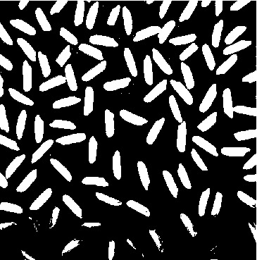
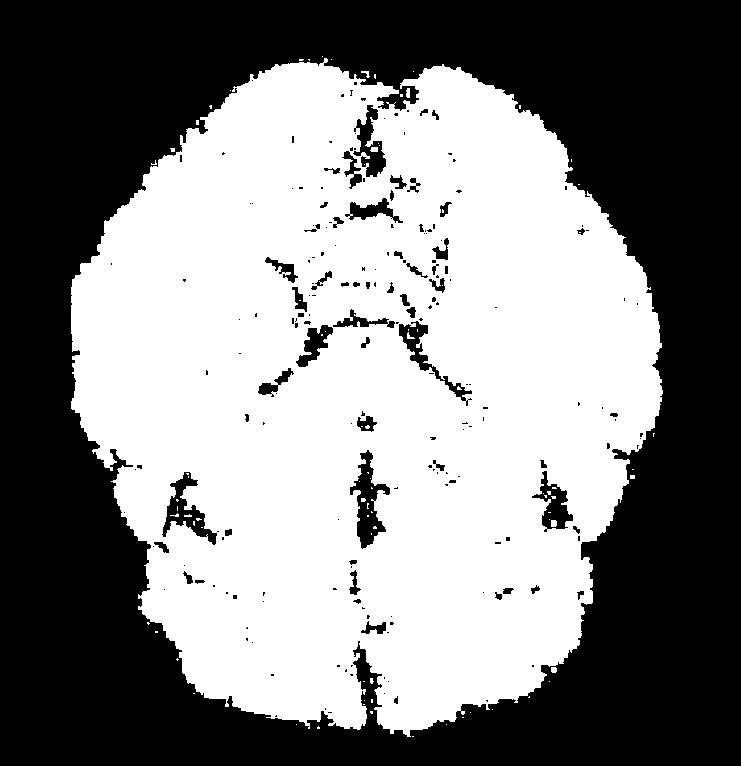
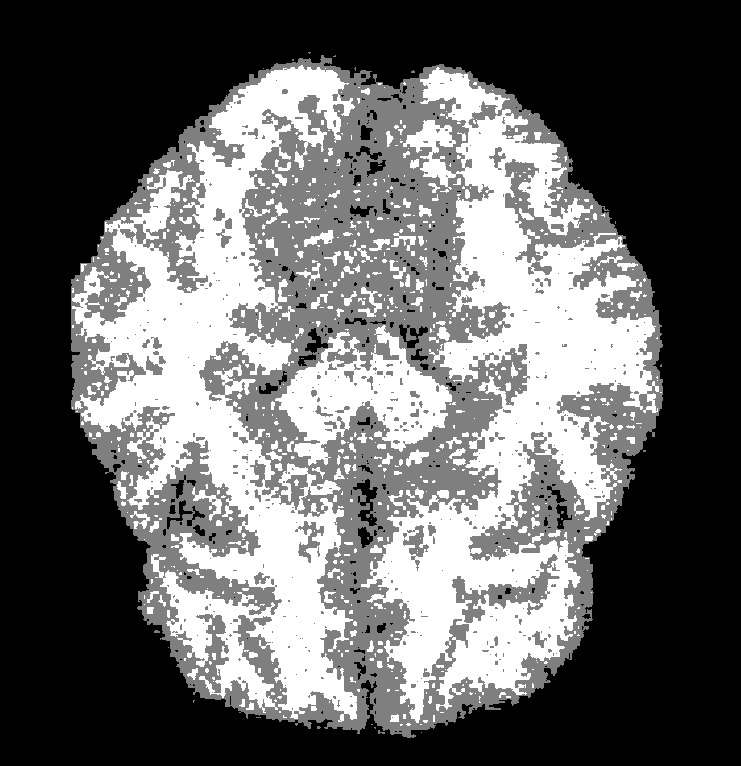
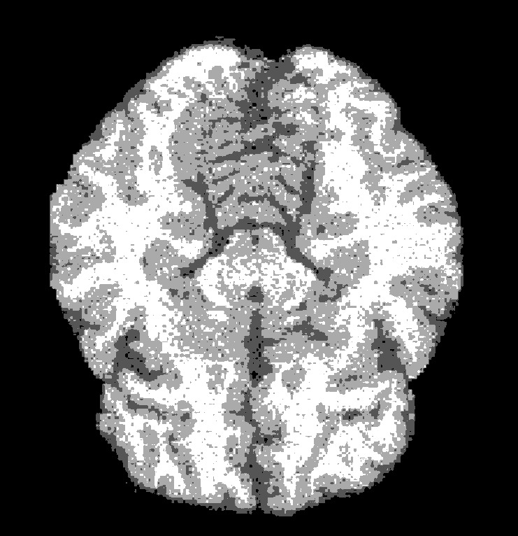

### Анализ результатов работы по изучению методов пороговых изображений.
* При сегментациии изображения зёрен риса (на 2 класса), можно видеть, что метод Оцу очень хорошо справляется со своей задачей:

    

* Так же мы видим хорошие результаты при сегментации изображения мозга (оригинальное изображение можно найти в `images/src/brain.pgm`) на 3 и 4 класса:
    * 2 класса
        
    * 3 класса
        
    * 4 класса
        
      
    При попытке разбить изображение на 5 классов, можно заметить, что минусом метода Оцу является долгое время работы, поэтому он применим, если изображение кластеризуется только на 2-4 класса.
      
